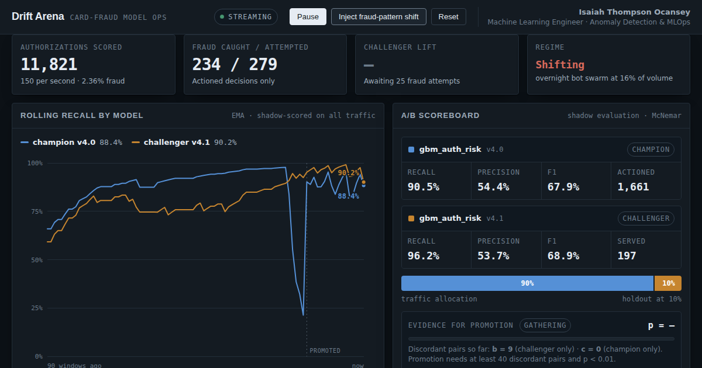

# Drift Arena

A browser-based champion/challenger console for card-fraud detection. It runs the
full production ML lifecycle — shadow scoring, drift detection, adaptive traffic
allocation, and statistically gated promotion — against a live synthetic
authorization stream.

**[Open the live console →](https://ocansey.github.io/drift-arena/)**



---

## What it demonstrates

Production fraud models rarely fail loudly. They decay as the behaviour they were
trained on stops resembling the behaviour they see. This console makes that decay
visible and then shows the machinery that catches it.

The champion model deliberately lacks a `velocity_1h` feature. When a card-testing
attack enters the stream — sub-$20 authorizations, high one-hour velocity,
devices under 30 days old — the fraud sits below the champion's decision boundary
and its recall collapses from roughly 97% to 25%. The challenger, which uses
velocity, holds. Everything that follows is the system responding to that gap.

## The pipeline

**1 · Shadow scoring.** Every authorization is scored by *both* models, so the
challenger is evaluated on 100% of traffic from the first second. Only the arm a
transaction is routed to actually decides the outcome — full statistical power,
bounded business risk.

**2 · Drift detection.** Each input feature is binned against the distribution
captured at training time and scored with the Population Stability Index:

```
PSI = Σ (aᵢ − eᵢ) · ln(aᵢ / eᵢ)
```

over a rolling 400-event window. Two or more features crossing 0.25 fires the
alarm.

**3 · Adaptive allocation.** A drift alarm rebalances traffic from 90/10 to
50/50. Under a shifting distribution, the cost of running an under-powered test
exceeds the cost of exposing more traffic to the challenger.

**4 · Gated promotion.** Because both models judge the same authorizations, the
outcomes are **paired** — a two-proportion z-test would assume an independence
that isn't there and would be under-powered. The gate is McNemar's test on
discordant pairs:

```
χ²(1) = (|b − c| − 1)² / (b + c)      # Yates continuity correction
```

where `b` = caught only by the challenger and `c` = caught only by the champion.
Promotion fires at `p < 0.01` with a minimum of 40 discordant pairs. On promotion
the PSI baseline re-anchors to the new population and a fresh challenger enters
at 10%.

## Implementation notes

Everything runs client-side in a single self-contained HTML file — no build step,
no dependencies, no network calls beyond the webfont. The PRNG is seeded, so the
simulation tells the same story on every load.

- **Data generator** — a two-component mixture. Organic traffic plus, under drift,
  one of three attack profiles (card-testing burst, overnight bot swarm,
  account-takeover wave), each with a distinct distributional signature.
- **Models** — hand-specified logistic scorers standing in for gradient-boosted
  trees, differing in which features they consume.
- **Statistics** — PSI, McNemar's χ² with continuity correction, and a normal CDF
  via an Abramowitz–Stegun error-function approximation, all computed live.
- **Charting** — hand-authored SVG with an auto-fitted y-domain, a right-anchored
  rolling window, crosshair tooltips, and promotion markers. Series colours are
  validated for colour-vision deficiency separation.

## Running locally

No server required:

```bash
open index.html
```

## Controls

| Control | Effect |
|---|---|
| **Inject fraud-pattern shift** | Introduces a new attack profile; each press rotates to a different one |
| **Pause / Resume** | Halts the stream without losing state |
| **Reset** | Restarts the simulation from the seeded initial conditions |

---

Built by **Isaiah Thompson Ocansey** — Machine Learning Engineer, Anomaly
Detection & MLOps.

The authorization stream is synthetic. The PSI computation, the McNemar test, and
the promotion gate are real code operating on live inputs.
